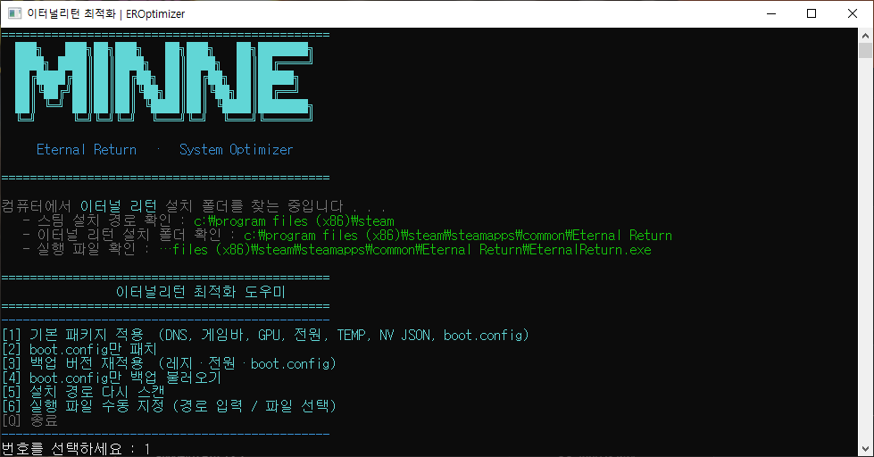
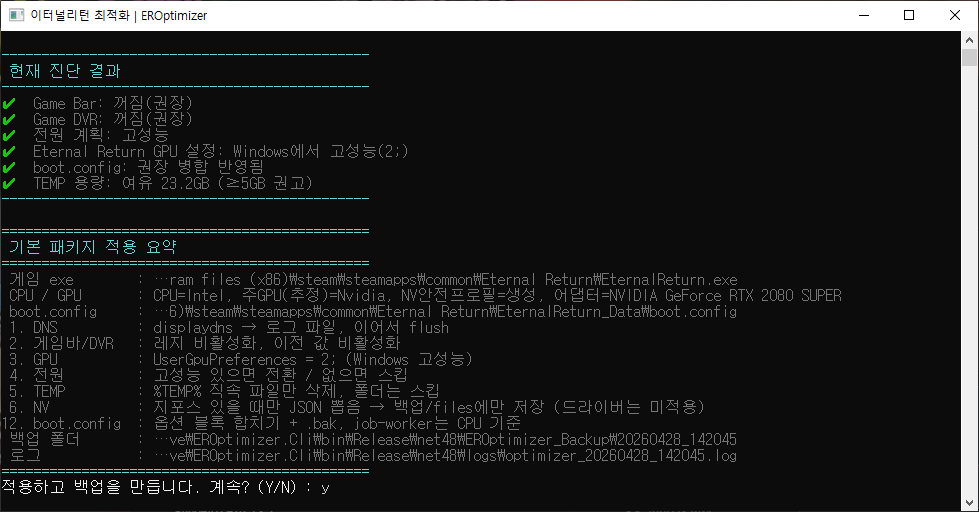
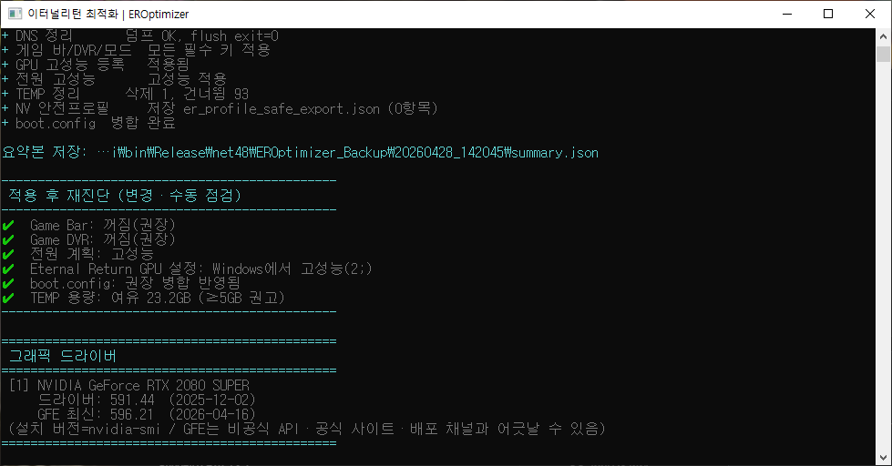

# EROptimizerNative

이터널 리턴(Steam 앱 `1049590`)용 — Windows·게임 쪽 세팅을 한 번에 손보는 **콘솔 도구**입니다.

실행하면 게임 설치 경로를 스캔하고, 메뉴에서 할 일을 고른 뒤 **`Y` 확인** 후 적용합니다. 바꾸기 전 값은 `EROptimizer_Backup\<날짜시간>`에 남습니다.

## 스크린샷

<p align="center">
  <b>메인 메뉴 · 설치 경로 탐색</b><br/>
  
</p>

<p align="center">
  <b>현재 진단 결과 · 기본 패키지 적용 요약 · 적용 확인(Y/N)</b><br/>
  
</p>

<p align="center">
  <b>적용 로그 · 적용 후 재진단 · 그래픽 드라이버</b><br/>
  
</p>

## 실행 화면 요약

제목 표시줄: **이터널리턴 최적화 \| EROptimizer**. 시작 시 아트 배너와 함께 Steam 라이브러리 등에서 **설치 경로·`EternalReturn.exe`** 를 찾아 출력합니다.

### 메뉴

| 키 | 동작 |
|----|------|
| **1** | 기본 패키지 — DNS, 게임 바/DVR, GPU 선호, 전원, `%TEMP%`, (조건부) NVIDIA 안전 프로필 JSON, `boot.config` 병합 |
| **2** | `boot.config` 만 패치 (백업 세션 + `summary.json`) |
| **3** | 예전 백업 세션 선택 후 레지·전원·`boot.config` 재적용 |
| **4** | **모니터 주사율 점검** — 기본 디스플레이 기준, 읽기 전용 (`EnumDisplaySettings`), 주사율 자동 변경 없음 |
| **5** | **오버레이·녹화·런처 점검** — Discord/Steam/Game Bar/NVIDIA/OBS 등 **실행 여부·CPU(약 1초)·RAM(Working Set)** 만 표시, **자동 종료 없음** |
| **6** | 세션에 있는 `boot.config` 백업만 골라 게임 쪽으로 복원 |
| **7** | 설치 경로만 다시 스캔 |
| **8** | 실행 파일 수동 지정 (경로 입력 또는 파일 선택) |
| **Q** | 종료 |

### 추가 진단·로컬 전용 안내

- **`[1]` 적용이 끝난 뒤** `추가 진단을 진행하시겠습니까? (Y/N)` 에서 `Y` 를 선택하면, **외부 웹 요청 없이** WMI·`user32`·프로세스 목록만으로 한 번 더 요약합니다. 상시 감시·백그라운드 동작 없음.
- 결과는 `logs\diagnostic_<세션>.log` 및 `logs\diagnostic_result_<세션>.json` 에 저장됩니다.
- **그래픽 드라이버**: 최신 버전을 인터넷으로 비교하지 않으며, 설치된 **DriverDate** 만으로 참고 문구를 붙입니다. Vendor 는 PNPDeviceID(`VEN_10DE` 등)와 이름으로 `NVIDIA` / `AMD` / `Intel` 을 구분합니다.
- **모니터 주사율**: 현재/가능 후보만 표시하며, Windows 설정을 **자동으로 바꾸지 않습니다**.
- **오버레이 점검**: 나열된 프로세스 이름이 **실행 중인지**와 리소스 사용만 보여 주며, **종료·후킹·메모리 접근 없음**.

### 참고 (저장소 청소)

과거에 넣었던 **PC 저장소 청소** 기능은, 실행 파일에서 임시·캐시 경로를 다루는 방식 때문에 일부 백신에서 **오탐(오진)** 으로 잡히는 경우가 많아 **코드에서 제거**했습니다.

### [1] 기본 패키지를 고른 경우 흐름

1. **현재 진단 결과** — 아래 항목을 ✔/❌ 로 표시합니다.  
   Game Bar, Game DVR, 전원 계획(고성능 여부), Eternal Return GPU 설정(`UserGpuPreferences`), `boot.config` 권장 병합 여부, TEMP 드라이브 여유(5GB 권고 등).
2. **기본 패키지 적용 요약** — 게임 exe 경로, CPU/GPU 요약, 수행할 단계 설명, 백업·로그 경로.
3. **`적용하고 백업을 만듭니다. 계속? (Y/N)`** — `Y` 일 때만 레지·파일 등 변경.
4. 단계별 결과(+/-) 한 줄씩 출력 후 세션 폴더에 **`summary.json`** 저장.
5. **적용 후 재진단** — 같은 항목으로 다시 스캔해, 적용된 항목은 ✔ 로 바뀐 상태를 보여 줍니다.
6. **`추가 진단을 진행하시겠습니까? (Y/N)`** — `Y` 이면 로컬 전용 추가 요약(전원·게임바·GPU·boot·드라이버 날짜 참고·기본 디스플레이 주사율·오버레이 프로세스) 후 `logs\diagnostic_*` / `diagnostic_result_*.json` 저장.

## 게임 경로

HKCU Steam 경로 → `libraryfolders.vdf` 로 라이브러리를 모은 뒤, 각 `steamapps` 에서 **`appmanifest_1049590.acf`** 로 설치 폴더를 잡습니다. exe는 **`EternalReturn.exe`** 우선.

자동 실패 시 **`[8]`** 에서 경로를 붙여 넣거나 파일 대화상자로 지정합니다. **`[7]`** 은 설정을 바꾸지 않고 탐색만 다시 합니다.

## 기본 패키지가 하는 일 (요약)

| 구분 | 내용 |
|------|------|
| **DNS** | `ipconfig /displaydns` 를 `logs\dns_before_<세션>.txt` 에 남긴 뒤 flush. |
| **게임 바 / DVR** | HKCU·일부 HKLM DWORD로 끔. 이전 값 → `registry_backup.json`. |
| **GPU** | `HKCU\...\UserGpuPreferences` 에 게임 exe에 `2;` (Windows 고성능). |
| **전원** | 현재 계획 GUID를 `power_plan_backup.txt` 에 기록한 뒤, 표준 **고성능** 이 있으면 전환(없으면 건너뜀). |
| **TEMP** | `%TEMP%` **바로 아래 파일만** 삭제(폴더는 건너뜀). |
| **NVIDIA JSON** | 지포스가 보일 때만. 내장 `er_profile_backup.json` 을 다듬어 `files\er_profile_safe_export.json` 으로 저장(직접 레지 적용 안 함). |
| **boot.config** | `EternalReturn_Data\boot.config` 백업 후 옵션 블록 병합. `job-worker-count` = `max(1, 논리 CPU − 1)`. |

자세한 로그: `logs\optimizer_<세션>.log`.

## 복원

- **`[3]`** — `registry_backup.json` 으로 레지 되돌림 + `power_plan_backup.txt` 의 GUID로 `powercfg /setactive`.
- **`boot.config`** — 해당 세션 `files\boot.config.bak_*` 중 경로 문자열 기준 맨 앞 항목 사용. **`[6]`** 는 목록에서 번호로 고름.

## 빌드·실행

Windows x64, **.NET Framework 4.8**, 관리자 실행 권장.

4.8 없으면: https://dotnet.microsoft.com/download/dotnet-framework/net48

```powershell
dotnet build EROptimizerNative.sln -c Release -m:1
```

출력: `EROptimizer.Cli\bin\Release\net48\`

**Release 배포물:** `EROptimizer.exe` + `EROptimizer.exe.config` 두 개면 됨(pdb 선택). `EROptimizer.Core`·`Newtonsoft.Json`·`System.CodeDom` 은 **ILRepack**으로 단일 exe에 합쳐진 빌드가 생성됩니다.

`dotnet build ... -c Debug` 는 repack 안 함 → 옆에 dll 이 생김. 배포는 **Release** 권장.

아이콘은 저장소에 없음. 로컬에서 `tools/build_app_icon.py` 로 `EROptimizer.Cli/app.ico` 를 만든 뒤 csproj에 `<ApplicationIcon>` 을 넣을 수 있습니다.

## 주의

레지·전원·TEMP 등 시스템을 건드립니다. **`EROptimizer_Backup` 폴더는 삭제하지 마세요.**

해당 파일을 변조하여 사용 시 정지·손해·손실에 대해 제작자는 책임지지 않음.

게임 패치로 `boot.config` 가 바뀌면 병합 결과도 달라질 수 있습니다. 그럴 때는 다시 실행하거나 메뉴 **`[2]`** 로 boot.config 만 적용하면 됩니다.
